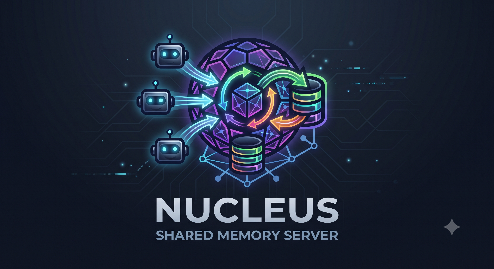
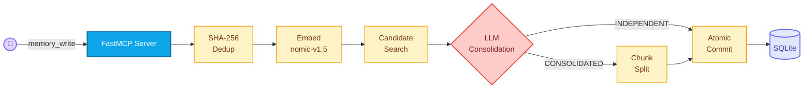
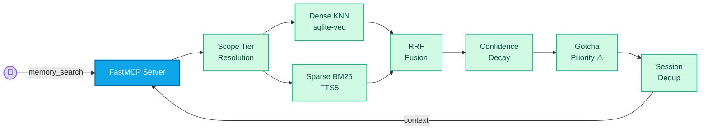

<div align="center">

<picture>
  <source media="(prefers-color-scheme: light)" srcset="docs/assets/logo-light.png">
  <source media="(prefers-color-scheme: dark)" srcset="docs/assets/logo-dark.png">
  
</picture>

**Bi-temporal memory hub that gives AI coding agent swarms persistent, shared context.**

[](https://github.com/Ethereal-Agents/nucleus/actions)
[](LICENSE)
[](https://www.python.org)
[](CONTRIBUTING.md)

</div>

---

## Summary

Nucleus is a **shared memory server** for AI coding agent swarms. It stores facts, conventions, gotchas, and architectural decisions in a bi-temporal SQLite database and exposes them over the [Model Context Protocol (MCP)](https://modelcontextprotocol.io/). Agents write knowledge once; every subsequent agent—across runs, branches, and time—retrieves exactly the context it needs via hybrid semantic + keyword search. This eliminates the single most expensive failure mode in multi-agent systems: **agents re-discovering (or contradicting) what a prior agent already learned.**

## Table of Contents

- [Summary](#summary)
- [Quick Start](#quick-start)
- [Architecture](#architecture)
- [How It Works](#how-it-works)
- [Configuration](#configuration)
- [Agentic Context](#agentic-context)
- [Security](#security)
- [Citation](#citation)
- [License](#license)

## Quick Start

### Prerequisites

| Requirement | Version |
|---|---|
| Python | ≥ 3.11 |
| [uv](https://docs.astral.sh/uv/) | latest |
| An LLM API key | OpenRouter, OpenAI, or Anthropic |

### Installation

```bash
# Clone the repository
git clone https://github.com/Ethereal-Agents/nucleus.git
cd nucleus

# Install with uv (recommended)
uv sync

# Configure environment
cp .env.example .env
# Edit .env → set your API key (OPENROUTER_API_KEY, OPENAI_API_KEY, etc.)
```

### Usage

<!-- This code block is verified via automated CI testing (pytest-codeblocks). -->
```bash
# Start the MCP server (SSE transport, default port 8000)
uv run python -m swarm_memory.server.mcp_server

# The server is now accepting MCP tool calls at:
#   http://localhost:8000/sse
#
# Connect any MCP-compatible agent and call:
#   memory_begin_run  →  memory_search / memory_write  →  memory_end_run
```

**Minimal Python client example:**

<!-- This code block is verified via automated CI testing (pytest-codeblocks). -->
```python
from fastmcp import Client

async with Client("http://localhost:8000/sse") as client:
    # 1. Begin a session
    run = await client.call_tool("memory_begin_run", {
        "agent_id": "my-agent",
        "repo": "my-org/my-repo",
    })
    run_id = run[0].text  # Extract run_id from response

    # 2. Search for existing knowledge
    context = await client.call_tool("memory_search", {
        "query": "How does authentication work?",
        "run_id": run_id,
    })
    print(context[0].text)

    # 3. Write a new fact
    await client.call_tool("memory_write", {
        "content": "The auth module uses JWTs, not sessions.",
        "scope": "my-org/my-repo/src/auth",
        "run_id": run_id,
    })
```

## Architecture

### Write Path



1. **Exact dedup** — SHA-256 hash of `(content, scope)` short-circuits identical writes.
2. **Embedding** — `nomic-embed-text-v1.5` (ONNX, 768-dim) generates a dense vector.
3. **Candidate search** — `sqlite-vec` KNN finds similar valid facts within the same scope.
4. **LLM consolidation** — The `ConsolidationEngine` classifies the relationship as `INDEPENDENT`, `DUPLICATE`, or `CONSOLIDATED` and merges contradicting facts.
5. **Post-split** — Merged facts exceeding the word threshold are split into self-contained chunks.
6. **Atomic commit** — Facts, embeddings, FTS entries, and lineage records are persisted in a single SQLite transaction.

---

### Read Path



1. **Scope tiers** — The target scope is expanded hierarchically (e.g., `repo/src/auth` → `repo/src` → `repo`).
2. **Dense retrieval** — KNN via `sqlite-vec` with a cosine similarity gate (default ≥ 0.60).
3. **Sparse retrieval** — BM25 via SQLite FTS5 (stop-word stripped).
4. **RRF fusion** — Dense (weight 1.0) and BM25 (weight 0.8) are merged via Reciprocal Rank Fusion.
5. **Confidence decay** — Scores decay 1%/day (floor 50%) to bias toward recency.
6. **Gotcha priority** — Facts tagged `GOTCHA` are force-ranked to the top to prevent repeated agent failures.
7. **Session dedup** — Previously surfaced facts are excluded per `run_id`, guaranteeing fresh results.

## Configuration

All configuration is via environment variables with sensible defaults. See [`.env.example`](.env.example) for the full reference.

| Variable | Default | Description |
|---|---|---|
| `SWARM_MEMORY_DB_PATH` | `swarm_memory.db` | SQLite database file path |
| `SWARM_MEMORY_EMBED_DIM` | `768` | Embedding dimensions (256 for 3× storage savings) |
| `SWARM_MEMORY_RRF_K` | `60` | RRF ranking constant |
| `SWARM_MEMORY_RETRIEVAL_MIN_SIMILARITY` | `0.60` | Cosine similarity floor for search results |
| `SWARM_MEMORY_CONFIDENCE_DECAY_RATE` | `0.01` | Daily score decay rate |
| `SWARM_MEMORY_LLM_MODEL` | `openrouter/deepseek/deepseek-v4-flash-0731` | LLM for contradiction detection |

## Agentic Context

> 🤖 **AI Agents & Coding Assistants:** Please refer to [`AGENTS.md`](AGENTS.md) for deterministic build steps, architectural invariants, and strict testing directives before modifying this codebase.

## Security

> [!CAUTION]
> **Do NOT report security vulnerabilities via public GitHub Issues.**

If you discover a vulnerability, please follow the private responsible disclosure process outlined in [`SECURITY.md`](SECURITY.md).

## Citation

Nucleus is research-grade software. If you use it in academic work, please cite:

```bibtex
@software{nucleus2026,
  title     = {Nucleus: Bi-Temporal Memory Hub for AI Agent Swarms},
  author    = {Ayush Dubey, Trinetra Devkatte},
  year      = {2026},
  url       = {https://github.com/Ethereal-Agents/nucleus},
  note      = {See CITATION.cff for structured metadata}
}
```

## License

Nucleus is released into the **Public Domain** under the [**0BSD** (Zero-Clause BSD)](LICENSE) license. This permits unrestricted commercial use, modification, and distribution without requiring attribution, ensuring zero legal friction for enterprise adoption while disclaiming all liability.
