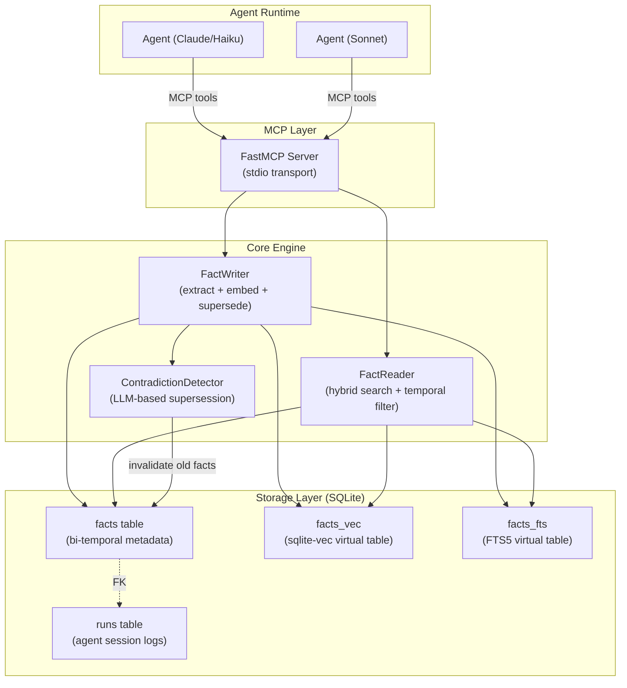
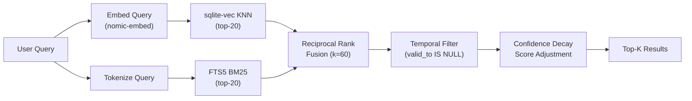
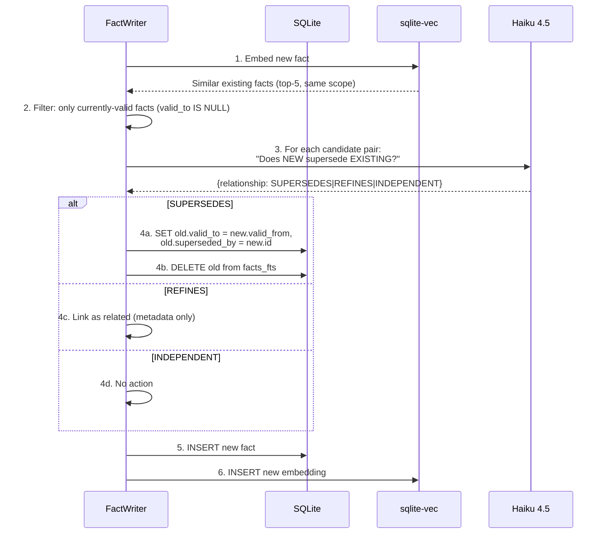
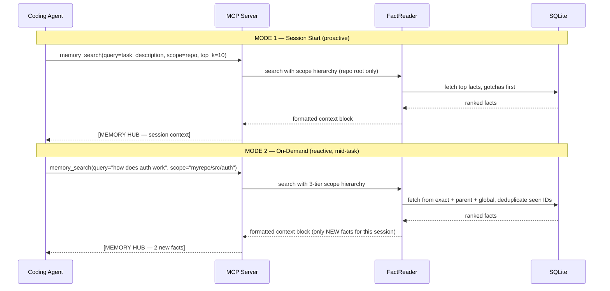

# Bi-Temporal SQLite Memory Hub — Implementation Plan

> **Status:** Ready for review → proceed to implement  
> **Target:** `swarm-memory/` package inside the Nucleus monorepo  
> **Timeline:** W5 (Jul 3–5 build, Jul 6–7 integration)  
> **Budget:** $0 infra (SQLite + local embeddings + FTS5)

---

## 0. Architecture Overview



---

## 1. Project Structure

```text
Nuclues/
├── swarm_memory/
│   ├── __init__.py
│   ├── core/
│   │   ├── __init__.py
│   │   ├── config.py          # Configuration constants
│   │   └── models.py          # Pydantic data models (Fact, Run, SearchResult)
│   ├── store/
│   │   ├── __init__.py
│   │   └── db.py              # SQLite schema, migrations, connection management
│   ├── retrieval/
│   │   ├── __init__.py
│   │   ├── embeddings.py      # Embedding model wrapper (nomic-embed-text-v1.5)
│   │   └── reader.py          # FactReader: hybrid search (dense + BM25 via RRF)
│   ├── ingestion/
│   │   ├── __init__.py
│   │   ├── writer.py          # FactWriter: ingest, embed, detect contradictions, store
│   │   └── supersession.py    # ContradictionDetector: LLM-based temporal supersession
│   └── server/
│       ├── __init__.py
│       └── mcp.py             # FastMCP server (exposes memory tools)
├── tests/
│   ├── __init__.py
│   ├── store/
│   │   └── test_db.py
│   ├── retrieval/
│   │   └── test_reader.py
│   ├── ingestion/
│   │   ├── test_writer.py
│   │   └── test_supersession.py
│   └── server/
│       └── test_mcp.py
├── pyproject.toml
└── README.md
```

---

## 2. SQLite Schema (bi-temporal, SOTA)

### 2.1 Design Principles (derived from Graphiti + temporal DB literature)

| Principle | Implementation |
|---|---|
| **Two independent timelines** | `valid_from`/`valid_to` (real-world validity) + `created_at` (system awareness). Graphiti uses 4 timestamps; we collapse the system timeline to `created_at` + `superseded_by` FK for simplicity — sufficient when we have a single writer per transaction. |
| **Never delete, always supersede** | Old facts get `valid_to` set + `superseded_by` pointed to the new fact. The old row is preserved for audit and point-in-time queries. This is the core wedge vs. Mem0's ADD-only. |
| **Scope-partitioned** | Every fact is scoped to `repo/module_path`. Queries are always scope-filtered first, making index usage efficient. |
| **Embedding co-stored** | Vector stored in a `vec0` virtual table linked by `fact_id`. Avoids a separate vector DB. |
| **Full-text indexed** | FTS5 virtual table on `content` for BM25 keyword search. Combined with dense search via RRF. |

### 2.2 SQL Schema

```sql
-- ============================================================
-- Core tables
-- ============================================================

CREATE TABLE IF NOT EXISTS runs (
    id              TEXT PRIMARY KEY,                    -- UUID v7 (time-sortable)
    agent_id        TEXT NOT NULL,                       -- which agent/developer
    repo            TEXT NOT NULL,                       -- repository identifier
    branch          TEXT,                                -- git branch (optional)
    summary         TEXT,                                -- end-of-run trajectory summary
    model           TEXT,                                -- model used (haiku-4.5, sonnet, etc.)
    input_tokens    INTEGER DEFAULT 0,                   -- token accounting
    output_tokens   INTEGER DEFAULT 0,
    total_cost_usd  REAL DEFAULT 0.0,                    -- cost tracking
    started_at      TEXT NOT NULL,                        -- ISO-8601
    finished_at     TEXT,                                 -- ISO-8601, NULL if still running
    created_at      TEXT NOT NULL DEFAULT (strftime('%Y-%m-%dT%H:%M:%fZ', 'now'))
);

CREATE TABLE IF NOT EXISTS facts (
    id              TEXT PRIMARY KEY,                    -- UUID v7
    content         TEXT NOT NULL,                       -- the distilled fact/insight
    fact_type       TEXT NOT NULL DEFAULT 'insight',     -- 'insight' | 'convention' | 'architecture' | 'gotcha' | 'dependency'
    scope           TEXT NOT NULL,                       -- 'repo' | 'repo/path/to/module'
    confidence      REAL NOT NULL DEFAULT 1.0,           -- 0.0–1.0, for recency/frequency decay at read time

    -- ── Bi-temporal columns ──
    valid_from      TEXT NOT NULL,                       -- ISO-8601: when this fact became true in the real world
    valid_to        TEXT,                                -- ISO-8601: when this fact stopped being true (NULL = still valid)
    superseded_by   TEXT,                                -- FK → facts.id of the replacing fact (NULL = current)

    -- ── System / provenance columns ──
    created_at      TEXT NOT NULL DEFAULT (strftime('%Y-%m-%dT%H:%M:%fZ', 'now')),
    source_run_id   TEXT NOT NULL,                       -- FK → runs.id (provenance)
    source_branch   TEXT,                                -- git branch at extraction time (provenance; NOT used in queries until post-V1)
    extraction_method TEXT DEFAULT 'llm_summary',        -- 'llm_summary' | 'manual' | 'tool_output'
    content_hash    TEXT,                                -- SHA-256 of (content || '|' || scope); enforces idempotent write dedup

    FOREIGN KEY (superseded_by) REFERENCES facts(id),
    FOREIGN KEY (source_run_id) REFERENCES runs(id),
    UNIQUE(content_hash)                                 -- prevents duplicate facts from re-extraction (NULL values are excluded)
);

-- ============================================================
-- Indexes (tuned for the 3 primary query patterns)
-- ============================================================

-- Pattern 1: "Current facts for this scope" (most common)
CREATE INDEX IF NOT EXISTS idx_facts_current
    ON facts(scope, valid_to)
    WHERE valid_to IS NULL AND superseded_by IS NULL;

-- Pattern 2: "Point-in-time: what was true at time T in scope S?"
CREATE INDEX IF NOT EXISTS idx_facts_valid_range
    ON facts(scope, valid_from, valid_to);

-- Pattern 3: Supersession chain traversal
CREATE INDEX IF NOT EXISTS idx_facts_superseded_by
    ON facts(superseded_by)
    WHERE superseded_by IS NOT NULL;

-- Pattern 4: Provenance lookup
CREATE INDEX IF NOT EXISTS idx_facts_source_run
    ON facts(source_run_id);

-- Pattern 5: Fact type filtering
CREATE INDEX IF NOT EXISTS idx_facts_type
    ON facts(fact_type, scope);

-- ============================================================
-- Vector search (sqlite-vec)
-- ============================================================

-- 768-dim float32 vectors from nomic-embed-text-v1.5
-- Can truncate to 256 via Matryoshka for speed; set in config
CREATE VIRTUAL TABLE IF NOT EXISTS facts_vec USING vec0(
    fact_id TEXT PRIMARY KEY,
    embedding float[768]
);

-- ============================================================
-- Full-text search (FTS5, built-in BM25)
-- ============================================================

CREATE VIRTUAL TABLE IF NOT EXISTS facts_fts USING fts5(
    fact_id UNINDEXED,
    content,
    scope UNINDEXED,
    tokenize='porter unicode61'
);
```

### 2.3 Key Queries

```sql
-- ── WRITE: Insert a new fact ──
INSERT INTO facts (id, content, fact_type, scope, confidence, valid_from, source_run_id)
VALUES (?, ?, ?, ?, ?, ?, ?);

INSERT INTO facts_vec (fact_id, embedding) VALUES (?, ?);
INSERT INTO facts_fts (fact_id, content, scope) VALUES (?, ?, ?);

-- ── READ: Current facts for a scope ──
SELECT * FROM facts
WHERE scope = ? AND valid_to IS NULL AND superseded_by IS NULL
ORDER BY created_at DESC;

-- ── READ: Point-in-time (AS OF) query ──
SELECT * FROM facts
WHERE scope = ?
  AND valid_from <= ?                          -- fact existed at that time
  AND (valid_to IS NULL OR valid_to > ?)       -- fact hadn't been invalidated
ORDER BY created_at DESC;

-- ── WRITE: Supersede an old fact ──
UPDATE facts
SET valid_to = ?, superseded_by = ?
WHERE id = ?;

-- Remove from FTS (stale facts shouldn't rank in keyword search)
DELETE FROM facts_fts WHERE fact_id = ?;
```

---

## 3. Hybrid Retrieval Engine (Dense + BM25 + RRF)

### 3.1 Architecture



### 3.2 RRF Implementation

```python
def reciprocal_rank_fusion(
    *result_lists: list[tuple[str, float]],
    k: int = 60,
    weights: list[float] | None = None,
) -> list[tuple[str, float]]:
    """
    Fuse multiple ranked result lists using Reciprocal Rank Fusion.

    Each result_list: [(doc_id, raw_score), ...] sorted by relevance (best first).
    Returns: [(doc_id, rrf_score), ...] sorted descending by fused score.

    The k parameter (default 60) controls how much weight is given to lower-ranked
    results. Higher k → more uniform weighting; lower k → top-heavy.
    """
    if weights is None:
        weights = [1.0] * len(result_lists)

    scores: dict[str, float] = {}
    for weight, results in zip(weights, result_lists):
        for rank, (doc_id, _) in enumerate(results, start=1):
            scores[doc_id] = scores.get(doc_id, 0.0) + weight / (k + rank)

    return sorted(scores.items(), key=lambda x: x[1], reverse=True)
```

### 3.3 Hybrid Search Pipeline (pseudo-code)

```python
def search(query: str, scope: str | None, as_of: str | None, top_k: int = 5) -> list[Fact]:
    # 1. Dense retrieval (scope-aware: pre-filter during KNN to avoid cross-repo contamination)
    query_vec = embed("search_query: " + query)
    if scope:
        scope_tiers = [s for s, _ in resolve_scope_tiers(scope)]
        placeholders = ",".join("?" * len(scope_tiers))
        vec_results = db.execute(f"""
            SELECT fv.fact_id, fv.distance
            FROM facts_vec fv
            JOIN facts f ON fv.fact_id = f.id
            WHERE fv.embedding MATCH ?
              AND f.scope IN ({placeholders})
              AND f.valid_to IS NULL
            ORDER BY fv.distance LIMIT 50   -- over-fetch: JOIN reduces result count
        """, [query_vec] + scope_tiers).fetchall()
    else:
        vec_results = db.execute("""
            SELECT fact_id, distance FROM facts_vec
            WHERE embedding MATCH ? ORDER BY distance LIMIT 20
        """, [query_vec]).fetchall()

    # 3. Fuse via RRF (weight dense slightly higher for semantic queries)
    fused = reciprocal_rank_fusion(
        vec_results, fts_results,
        k=60,
        weights=[1.0, 0.8]  # tunable; dense slightly preferred for code
    )

    # 4. Temporal filter — only return currently-valid facts
    candidate_ids = [doc_id for doc_id, _ in fused[:top_k * 3]]  # over-fetch
    facts = db.execute("""
        SELECT * FROM facts
        WHERE id IN ({placeholders})
          AND (valid_to IS NULL OR valid_to > ?)
          AND superseded_by IS NULL
          {scope_filter}
        ORDER BY confidence DESC, created_at DESC
    """, [...]).fetchall()

    # 5. Apply confidence decay (recency bias)
    for fact in facts:
        age_days = (now() - fact.created_at).days
        fact.score *= max(0.5, 1.0 - (age_days * 0.01))  # 1% decay per day, floor 0.5

    return sorted(facts, key=lambda f: f.score, reverse=True)[:top_k]
```

### 3.4 Embedding Model

| Property | Value |
|---|---|
| **Model** | `nomic-ai/nomic-embed-text-v1.5` |
| **Dimensions** | 768 (full) or 256 (Matryoshka truncation for speed) |
| **Context** | 8,192 tokens |
| **Prefixes** | `"search_query: "` for queries, `"search_document: "` for facts |
| **Normalization** | `normalize_embeddings=True` (cosine similarity) |
| **Runtime** | CPU via `sentence-transformers`, no GPU required |
| **Cost** | $0 (local inference) |

> [!NOTE]
> **Why nomic over BGE-M3:** BGE-M3 (567M params) is more powerful but 4× larger. For a laptop-first system with <10k facts, nomic (137M params) loads in <2s on CPU and produces comparable results. The MRL truncation to 256 dims cuts storage by 3× with ~5% quality loss — a knob we can tune later.

### 3.5 Scope Hierarchy Resolution

The `search()` pipeline in §3.3 treats `scope` as an exact filter. For agent queries this is wrong — when an agent is working on `myrepo/src/auth/sessions.ts` it also needs facts scoped to the parent module and the global repo.

**Rule:** Scope is a **prefix hierarchy**. A query for a specific path implicitly includes all ancestor scopes.

```
Query scope: myrepo/src/auth/sessions.ts
  ├─ TIER 0  scope = 'myrepo/src/auth/sessions.ts'   ← exact file facts
  ├─ TIER 1  scope = 'myrepo/src/auth'               ← parent module facts
  └─ TIER 2  scope = 'myrepo'                        ← global repo facts
  ✗  EXCLUDED scope = 'myrepo/src/payments'          ← sibling scope — never included
```

```python
def resolve_scope_tiers(scope: str) -> list[tuple[str, int]]:
    """
    Returns [(scope, tier), ...] from most specific to most general.
    Tier is used as a sort key — lower tier = higher priority in results.
    """
    parts = scope.split("/")
    tiers = []
    for i in range(len(parts), 0, -1):
        tiers.append(("/".join(parts[:i]), len(parts) - i))
    return tiers  # [(exact, 0), (parent, 1), (repo_root, 2), ...]
```

```python
# Dynamic scope-tiered query — handles paths of arbitrary depth
# resolve_scope_tiers("myrepo/src/auth/sessions") returns:
# [("myrepo/src/auth/sessions", 0), ("myrepo/src/auth", 1), ("myrepo/src", 2), ("myrepo", 3)]
scope_tiers = resolve_scope_tiers(scope)  # [(path, tier_int), ...]
scope_paths = [s for s, _ in scope_tiers]
placeholders = ",".join("?" * len(scope_paths))
case_clauses = " ".join(f"WHEN ? THEN {t}" for _, t in scope_tiers)

facts = db.execute(f"""
    SELECT f.*
    FROM facts f
    WHERE f.scope IN ({placeholders})
      AND f.valid_to IS NULL
      AND f.superseded_by IS NULL
    ORDER BY
      CASE f.scope {case_clauses} END ASC,  -- most specific scope first
      confidence DESC
""", scope_paths + scope_paths).fetchall()
# scope_paths appears twice: once for IN filter, once for the CASE WHEN value list
```

> [!TIP]
> **Gotchas surface first.** After RRF fusion, re-sort so that `fact_type = 'gotcha'` facts always rank above same-scope, same-relevance facts of other types. A gotcha that an agent misses is infinitely more costly than a minor relevance penalty on an architecture fact.

### 3.6 Natural Language Query Handling

Agents query with free-form natural language — `"How do I connect to the database?"`, `"What are the gotchas for auth logout?"`, `"authentication"`. Both retrieval paths must handle this, but they have different requirements.

| Retrieval path | NL support | Reason |
|---|---|---|
| **Dense (sqlite-vec)** | ✅ Native | Embedding is semantic — NL query maps to the right vector space via `"search_query: "` prefix |
| **BM25 (FTS5)** | ⚠️ Needs preprocessing | FTS5 `MATCH` is a query language — raw NL with `?`, `'`, `!` causes syntax errors; stop words generate noise matches |

**Solution:** A `preprocess_for_fts5()` step converts the NL query to a valid FTS5 expression before the BM25 call. If the query is too vague (all stop words), BM25 is skipped entirely and retrieval falls back to dense-only.

```python
import re

STOP_WORDS = {
    "what", "is", "the", "how", "do", "does", "a", "an", "to", "for", "in",
    "of", "and", "or", "should", "i", "we", "it", "are", "be", "with",
    "this", "that", "can", "right", "way", "when", "where", "why", "which",
}

def preprocess_for_fts5(query: str) -> str | None:
    """
    Convert a natural language query into a valid FTS5 MATCH expression.
    Returns None if no meaningful terms remain — caller should skip BM25.
    """
    # Strip FTS5 operator characters (", *, ^, -, +, (, ))
    clean = re.sub(r'[^\w\s]', ' ', query.lower())

    # Keep only non-stop, non-trivial tokens
    terms = [t for t in clean.split() if t not in STOP_WORDS and len(t) > 2]

    if not terms:
        return None  # vague query — dense-only fallback

    # OR-join: partial matches still surface (AND would be too restrictive for short queries)
    return " OR ".join(terms)
```

**Example transformations:**

| Agent's natural language query | FTS5 expression | BM25 active? |
|---|---|---|
| `"How do I connect to the database?"` | `"connect OR database"` | ✅ |
| `"What's the gotcha with auth logout?"` | `"gotcha OR auth OR logout"` | ✅ |
| `"authentication"` | `"authentication"` (passthrough) | ✅ |
| `"What is it?"` | `None` | ❌ dense-only |

**Updated search pipeline (§3.3) with NL handling:**

```python
def search(query: str, scope: str | None, as_of: str | None, top_k: int = 5):
    # Dense path — always runs, receives full NL query
    query_vec = embed("search_query: " + query)
    vec_results = db.execute("SELECT fact_id, distance FROM facts_vec ...").fetchall()

    # BM25 path — only runs when FTS5 expression is valid
    fts_expr = preprocess_for_fts5(query)
    if fts_expr:
        fts_results = db.execute(
            "SELECT fact_id, bm25(facts_fts) FROM facts_fts WHERE facts_fts MATCH ?",
            [fts_expr],
        ).fetchall()
        fused = reciprocal_rank_fusion(vec_results, fts_results, weights=[1.0, 0.8])
    else:
        # Vague query — dense-only, no RRF weight distortion
        fused = [(fact_id, score) for fact_id, score in vec_results]

    # ... temporal filter, confidence decay, scope hierarchy (§3.5) ...
```

> [!NOTE]
> The dense path is the primary retrieval signal for NL queries. BM25 is a booster for queries with specific technical terms (function names, file paths, library names) where exact keyword matching outperforms semantic similarity. Most agent queries will benefit from both paths.

---

## 4. Temporal Supersession Engine

### 4.1 The Problem (Mem0's Structural Weakness)

When a new fact is ingested (e.g., *"The auth module now uses session tokens"*), we must detect that it contradicts an existing fact (*"The auth module uses JWT"*) and supersede the old one. **Mem0 v3 does not do this** — it appends both, and later retrieval serves both with equal confidence. This is our wedge.

### 4.2 Supersession Pipeline (adapted from Graphiti, simplified)



### 4.3 Contradiction Detection Prompt

```
You are a coding knowledge validator. Your job is to determine whether a NEW fact
about a codebase supersedes (contradicts/replaces) an EXISTING fact.

EXISTING FACT:
  Content: "{existing.content}"
  Scope: {existing.scope}
  Valid since: {existing.valid_from}
  Type: {existing.fact_type}

NEW FACT:
  Content: "{new.content}"
  Scope: {new.scope}
  Type: {new.fact_type}

Classify the relationship as exactly one of:
- SUPERSEDES: The new fact replaces or contradicts the existing fact.
  Examples: technology migration, API change, config change, deprecation.
- REFINES: The new fact adds detail without contradicting the existing fact.
  Examples: adding a caveat, noting an edge case, expanding on usage.
- INDEPENDENT: The facts are about different topics/aspects.

Respond ONLY with valid JSON:
{"relationship": "SUPERSEDES" | "REFINES" | "INDEPENDENT", "reason": "<one sentence>"}
```

### 4.4 Cost Analysis

| Step | Model | Input | Output | Cost/call |
|---|---|---|---|---|
| Contradiction check (per pair) | Haiku 4.5 | ~300 tokens | ~50 tokens | ~$0.0006 |
| Max pairs per fact ingestion | — | 5 candidates | — | ~$0.003 |
| Per run (avg 3 facts) | — | — | — | ~$0.009 |

> [!TIP]
> **Optimization:** Before calling the LLM, pre-filter with cosine similarity threshold (≥ 0.75). If no existing fact is semantically close, skip the LLM call entirely. This eliminates ~80% of LLM calls for independent facts.

---

## 5. MCP Server (FastMCP)

### 5.1 Tool Interface

```python
from fastmcp import FastMCP
from pydantic import BaseModel

mcp = FastMCP("SwarmMemory", description="Shared bi-temporal coding context hub")

# ── Tool 1: Write ──────────────────────────────────────────
class WriteResult(BaseModel):
    fact_id: str
    superseded_ids: list[str]
    status: str

@mcp.tool
def memory_write(
    content: str,
    scope: str,
    run_id: str,                         # required: from memory_begin_run()
    valid_from: str | None = None,
    fact_type: str = "insight",
    confidence: float = 1.0,             # 0.0–1.0; use <1.0 for uncertain/inferred facts
) -> WriteResult:
    """
    Write a new fact to the shared memory hub.
    Automatically detects and supersedes contradicting older facts.
    Idempotent: writing the same content+scope twice returns the existing fact.

    Args:
        content: The distilled fact or insight to store.
        scope: Codebase scope (e.g., 'myrepo' or 'myrepo/src/auth').
        run_id: ID returned by memory_begin_run(). Required for provenance.
        valid_from: ISO-8601 timestamp when this became true. Defaults to now.
        fact_type: One of 'insight', 'convention', 'architecture', 'gotcha', 'dependency'.
        confidence: Certainty of this fact (default 1.0). Use lower values for inferred facts.
    """
    ...

# ── Tool 2: Search ─────────────────────────────────────────
class SearchResult(BaseModel):
    fact_id: str
    content: str
    scope: str
    fact_type: str
    valid_from: str
    confidence: float
    relevance_score: float

@mcp.tool
def memory_search(
    query: str,
    scope: str | None = None,
    as_of: str | None = None,
    top_k: int = 5,
    fact_type: str | None = None,
) -> list[SearchResult]:
    """
    Search for relevant facts using hybrid retrieval (semantic + keyword).
    Returns only temporally-valid facts (not superseded).

    Args:
        query: Natural language search query.
        scope: Filter to a specific scope. If None, searches all scopes.
        as_of: ISO-8601 timestamp for point-in-time query. Defaults to now.
        top_k: Number of results to return.
        fact_type: Filter by fact type.
    """
    ...

# ── Tool 3: Invalidate ─────────────────────────────────────
@mcp.tool
def memory_invalidate(
    fact_id: str,
    reason: str,
    valid_to: str | None = None,
) -> dict:
    """
    Manually invalidate a fact that is no longer true.
    Use this when an agent discovers a stored fact is outdated.

    Args:
        fact_id: ID of the fact to invalidate.
        reason: Why this fact is being invalidated.
        valid_to: When the fact stopped being true. Defaults to now.
    """
    ...

# ── Tool 4: List runs ────────────────────────────────────
@mcp.tool
def memory_list_runs(
    repo: str | None = None,
    limit: int = 10,
) -> list[dict]:
    """
    List recent agent runs for a repository.
    Useful for understanding what prior agents have done.
    """
    ...

# ── Tool 5: Begin run ────────────────────────────────────
@mcp.tool
def memory_begin_run(
    repo: str,
    agent_id: str,
    branch: str | None = None,
    model: str | None = None,
) -> dict:
    """
    Register the start of an agent run. Returns a run_id to pass to all
    subsequent memory_write and memory_search calls.

    Call this at the very start of every agent run before any memory operations.
    Without a run_id, facts have no provenance and deduplication is disabled.

    Returns: {"run_id": "<uuid7>", "status": "started"}
    """
    ...

# ── Tool 6: End run ────────────────────────────────────
@mcp.tool
def memory_end_run(
    run_id: str,
    summary: str | None = None,
    input_tokens: int = 0,
    output_tokens: int = 0,
    total_cost_usd: float = 0.0,
) -> dict:
    """
    Mark an agent run as complete. Updates the run record with final token
    counts, cost, and summary. Flushes in-session dedup state for this run_id.

    Call at the very end of an agent run, after fact extraction is complete.
    Fact extraction (§13) should fire BEFORE this call.

    Returns: {"run_id": "<uuid7>", "status": "completed", "facts_written": N}
    """
    ...
```

### 5.2 Transport & Configuration

```json
// Claude Desktop / agent MCP config
{
  "mcpServers": {
    "swarm-memory": {
      "command": "python",
      "args": ["-m", "swarm_memory.server"],
      "env": {
        "SWARM_MEMORY_DB": "/path/to/shared/memory.db",
        "SWARM_MEMORY_EMBED_MODEL": "nomic-ai/nomic-embed-text-v1.5",
        "SWARM_MEMORY_EMBED_DIM": "768"
      }
    }
  }
}
```

---

## 6. Data Models (Pydantic)

```python
from pydantic import BaseModel, Field
from datetime import datetime, timezone
from enum import Enum
import uuid
import hashlib

class FactType(str, Enum):
    INSIGHT = "insight"             # General coding insight
    CONVENTION = "convention"       # Code style / naming / pattern convention
    ARCHITECTURE = "architecture"   # System design / module structure
    GOTCHA = "gotcha"               # Bug, pitfall, or non-obvious behavior
    DEPENDENCY = "dependency"       # Library, API, or service dependency info

class Relationship(str, Enum):
    SUPERSEDES = "SUPERSEDES"
    REFINES = "REFINES"
    INDEPENDENT = "INDEPENDENT"

class Fact(BaseModel):
    id: str = Field(default_factory=lambda: str(uuid.uuid7()))
    content: str
    fact_type: FactType = FactType.INSIGHT
    scope: str
    confidence: float = 1.0
    valid_from: datetime
    valid_to: datetime | None = None
    superseded_by: str | None = None
    created_at: datetime = Field(default_factory=lambda: datetime.now(timezone.utc))  # fix: utcnow() removed in 3.13
    source_run_id: str
    source_branch: str | None = None
    content_hash: str | None = None      # auto-computed on write: SHA-256(content + '|' + scope)
    extraction_method: str = "llm_summary"

class Run(BaseModel):
    id: str = Field(default_factory=lambda: str(uuid.uuid7()))
    agent_id: str
    repo: str
    branch: str | None = None
    summary: str | None = None
    model: str | None = None
    input_tokens: int = 0
    output_tokens: int = 0
    total_cost_usd: float = 0.0
    started_at: datetime
    finished_at: datetime | None = None

class SearchResult(BaseModel):
    fact: Fact
    relevance_score: float          # RRF fused score
    retrieval_method: str           # 'dense', 'bm25', or 'hybrid'
```

---

## 7. Implementation Phases

### Phase 1: Storage Foundation (Day 1 — ~3 hours)

| Task | File | Lines (est.) | Details |
|---|---|---|---|
| Schema creation + migrations | `db.py` | ~120 | All SQL from §2.2, connection pool, WAL mode, `PRAGMA` tuning |
| Data models | `models.py` | ~80 | Pydantic models from §6 |
| Config | `config.py` | ~30 | DB path, model name, embed dim, RRF k, decay rate |

**Key implementation details for `db.py`:**
```python
# Performance-critical PRAGMAs
db.execute("PRAGMA journal_mode=WAL")      # Write-Ahead Log for concurrent reads
db.execute("PRAGMA synchronous=NORMAL")    # Balance durability vs speed
db.execute("PRAGMA cache_size=-64000")     # 64MB page cache
db.execute("PRAGMA busy_timeout=5000")     # 5s wait on lock contention
db.execute("PRAGMA foreign_keys=ON")
```

### Phase 2: Embedding + Retrieval (Day 1 — ~3 hours)

| Task | File | Lines (est.) | Details |
|---|---|---|---|
| Embedding wrapper | `embeddings.py` | ~60 | Lazy-load nomic model, encode with prefix, normalize, cache |
| Hybrid search | `reader.py` | ~150 | Dense search, BM25 search, RRF fusion, temporal filter, confidence decay |

**Embedding caching strategy:**
```python
# Cache embeddings in memory for repeat queries within a session
# The model itself is loaded lazily on first call (~2s on CPU)
_model: SentenceTransformer | None = None

def get_model() -> SentenceTransformer:
    global _model
    if _model is None:
        _model = SentenceTransformer(
            config.EMBED_MODEL,
            trust_remote_code=True,
        )
    return _model

def embed(text: str, prefix: str = "search_document: ") -> bytes:
    model = get_model()
    vec = model.encode(
        prefix + text,
        normalize_embeddings=True,
    )
    return np.array(vec[:config.EMBED_DIM], dtype=np.float32).tobytes()
```

### Phase 3: Write Pipeline + Supersession (Day 2 — ~4 hours)

| Task | File | Lines (est.) | Details |
|---|---|---|---|
| Fact writer | `writer.py` | ~120 | Embed, find candidates, call contradiction detector, store |
| Contradiction detector | `supersession.py` | ~100 | LLM prompt from §4.3, parse response, batch optimization |

**Supersession flow:**
```python
import hashlib

async def write_fact(
    content: str, scope: str, valid_from: str, run_id: str, confidence: float = 1.0
) -> WriteResult:
    # 1. Content-hash idempotency check (avoids duplicate facts from re-extraction)
    content_hash = hashlib.sha256(f"{content}|{scope}".encode()).hexdigest()
    existing = db.execute(
        "SELECT id FROM facts WHERE content_hash = ?", [content_hash]
    ).fetchone()
    if existing:
        return WriteResult(fact_id=existing["id"], superseded_ids=[], status="duplicate")

    # 2. Embed the new fact
    embedding = embed(content, prefix="search_document: ")

    # 3. Find similar existing facts (same scope, currently valid)
    candidates = find_similar_valid_facts(embedding, scope, threshold=0.75, limit=5)

    # 4. Detect contradictions via LLM
    #    OUTSIDE the transaction — LLM calls must not hold DB locks (slow + unbounded latency)
    relationships = []
    for candidate in candidates:
        relationship = await detect_contradiction(candidate, content)
        relationships.append((candidate, relationship))

    # 5. ALL DB mutations in ONE atomic transaction
    #    New fact is inserted FIRST so the FK reference (superseded_by → new_fact.id)
    #    is valid when old facts are invalidated. Violating this order causes FK errors.
    superseded_ids = []
    with db.transaction():
        insert_fact(new_fact)                           # ← must be first
        insert_embedding(new_fact.id, embedding)
        insert_fts(new_fact.id, content, scope)

        for candidate, relationship in relationships:
            if relationship == Relationship.SUPERSEDES:
                invalidate_fact(
                    candidate.id,
                    superseded_by=new_fact.id,          # FK valid now — new_fact exists
                    valid_to=valid_from,
                )
                delete_fts(candidate.id)                # stale facts off keyword index
                superseded_ids.append(candidate.id)

    return WriteResult(fact_id=new_fact.id, superseded_ids=superseded_ids, status="created")
```

### Phase 4: MCP Server (Day 2 — ~2 hours)

| Task | File | Lines (est.) | Details |
|---|---|---|---|
| MCP server | `server.py` | ~100 | FastMCP tools from §5.1, stdio transport |
| Integration test | `tests/test_server.py` | ~80 | End-to-end: write → supersede → search |

### Phase 5: Testing + Polish (Day 3 — ~3 hours)

| Task | File | Lines (est.) | Details |
|---|---|---|---|
| Unit tests | `tests/test_*.py` | ~200 | Schema, CRUD, supersession, RRF, temporal queries |
| Smoke test script | `tests/smoke.py` | ~50 | Full lifecycle: write 5 facts, supersede 1, search, verify |

**Total estimated code:** ~1,100 lines (including tests)

---

## 8. Dependencies

```toml
[project]
name = "swarm-memory"
version = "0.1.0"
requires-python = ">=3.11"
dependencies = [
    "fastmcp>=2.0",              # MCP server SDK
    "sqlite-vec>=0.1.6",         # Vector search extension for SQLite
    "sentence-transformers>=3.0", # Local embedding models
    "numpy>=1.26",               # Array ops for embeddings
    "pydantic>=2.0",             # Data validation
    "anthropic>=0.40",           # Haiku API for contradiction detection (optional)
    "uuid7>=0.1.0",              # Time-sortable UUIDs
]

[project.optional-dependencies]
dev = [
    "pytest>=8.0",
    "pytest-asyncio>=0.24",
]
```

> [!IMPORTANT]
> **Zero external services.** The only network call is to the Anthropic API for contradiction detection (Haiku 4.5, ~$0.003/fact). Everything else runs locally: SQLite, embeddings, FTS5, vector search.

---

## 9. Performance Targets

| Operation | Target | Mechanism |
|---|---|---|
| **Write (with supersession)** | < 2s per fact | Embedding ~200ms (CPU), LLM contradiction check ~500ms, SQLite insert ~5ms |
| **Write (no contradiction)** | < 500ms per fact | Skip LLM when no similar candidates above cosine threshold |
| **Search (hybrid)** | < 300ms per query | sqlite-vec brute-force KNN + FTS5, both sub-100ms at <10k facts |
| **Point-in-time query** | < 50ms | Indexed range scan on `(scope, valid_from, valid_to)` |
| **DB size (1k facts)** | < 10MB | Facts ~1KB avg + 768×4 bytes embedding = ~4KB/fact |
| **Model load (cold start)** | < 3s | One-time; model cached in memory for session |

---

## 10. Correctness Invariants (enforced by tests)

1. **No fact is ever deleted.** Only `valid_to` and `superseded_by` are updated.
2. **Supersession is transitive.** If A supersedes B, and C supersedes A, then querying "current" returns only C.
3. **Point-in-time consistency.** `search(as_of=T)` returns exactly the facts that were valid at time T.
4. **FTS index consistency.** Superseded facts are removed from `facts_fts` so they don't pollute keyword search, but remain in `facts` and `facts_vec` for audit/historical queries.
5. **Scope isolation.** A fact in scope `repo/auth` is never automatically compared against a fact in scope `repo/payments` for supersession.
6. **Idempotent writes.** Writing the same content + scope + valid_from twice produces one fact (content-hash dedup).

---

## 11. What This Doesn't Build (Explicit Cuts)

| Feature | Why cut | Re-trigger condition |
|---|---|---|
| Async sleep-time consolidation | Scale optimization; <1k facts won't bloat | Store exceeds 5k facts AND dedup latency > 100ms |
| Bayesian forgetting (log-odds decay) | Premature; simple linear decay suffices | Benchmark shows confidence-weighted retrieval underperforms |
| Graph traversal / Neo4j | No evidence of multi-hop need yet | Team-SWE benchmark shows dense+BM25 losing on "why" queries |
| Multi-writer concurrency / backpressure | Ayush's W6 scope (solo artifact) | After V0 proves the schema |
| Automatic fact extraction from code diffs | Requires AST parsing; out of scope for V0 | After end-of-run summarization proves value |

---

## 12. Verification Checklist (before marking V0 complete)

- [ ] Schema creates cleanly on fresh SQLite DB
- [ ] `content_hash UNIQUE` constraint rejects duplicate fact on second write (returns `status="duplicate"`)
- [ ] Write a fact → appears in `facts`, `facts_vec`, `facts_fts` with `content_hash` populated
- [ ] Write a contradicting fact → old fact gets `valid_to` set, `superseded_by` points to new (both in same transaction)
- [ ] `memory_search` returns only currently-valid facts by default
- [ ] `memory_search(as_of=...)` returns point-in-time snapshot
- [ ] Hybrid search (dense + BM25) returns better top-1 than either alone (manual spot-check on 5 queries)
- [ ] `memory_begin_run()` creates a run record and returns a UUID run_id
- [ ] `memory_end_run()` marks run complete and evicts session from `_session_seen`
- [ ] MCP server starts via `python -m swarm_memory.server` and responds to tool calls
- [ ] Full `begin_run → write → supersede → search → end_run` lifecycle works end-to-end via MCP
- [ ] Session dedup: same fact ID not returned twice for same run_id across multiple searches
- [ ] Stale sessions (idle > 2h) evicted automatically from `_session_seen`
- [ ] All tests pass
- [ ] DB file < 10MB after 100 facts

---

## 13. Post-Run Fact Extraction System

> **Status:** Design finalised — implement in Phase 3 alongside `writer.py`

Fact extraction runs **once, at the end of every agent run**, using the trajectory already in the KV cache. This is the primary ingestion path into the memory hub.

### 13.1 Why End-of-Run Only

Prompt caching economics make mid-run extraction wasteful:

| Extraction timing | Input cost (50k token run) | Notes |
|---|---|---|
| End-of-run (cache hit) | ~$0.015 | Trajectory already in KV cache |
| Re-read from disk (cache cold) | ~$0.150 | 10× more expensive |
| Output tokens (either) | ~$0.008 | ~500 tokens of JSON facts |

**Total per run ≈ $0.023** — almost entirely output tokens when the cache is warm.

### 13.2 Compaction Handling

When a compaction event fires mid-run, the pre-compaction trajectory is replaced by a prose summary. We never re-read the cold full trajectory.

```
Run completes
     │
     ├─ No compaction? → Run Prompt V1 on full trajectory (cached) ✓
     │
     └─ Compaction occurred?
          ├─ Run Prompt V1 on post-compaction raw steps (cached) ✓
          └─ Run Prompt V2 on the compaction summary from JSONL transcript (short, cheap)
               └─ Merge + deduplicate both outputs before writing to DB
```

The compaction summary is already available in the JSONL transcript on disk — it is itself a distilled representation and rarely exceeds 5k tokens. The combined cost stays under $0.05 per run.

**What we lose:** Fine-grained step-level nuance from the pre-compaction portion. In practice, architecture decisions, conventions, and gotchas always surface in the compaction summary because that is what compaction is designed to preserve. Transient debugging steps (which we would IGNORE anyway) are what gets lost — this is acceptable.

### 13.3 Extraction Prompt V1 — Raw Trajectory

Use when the trajectory is a full tool-call log (no compaction, or the post-compaction raw steps).

```
You are an expert Principal Engineer summarizing a completed coding task.
Your goal is to extract durable, transferable facts from the agent's run trajectory
that will be stored in a shared memory hub. These facts onboard future agents
working on this codebase.

Repository: {repo}
Run started: {run_started_at}

Here is the trajectory of the agent's completed run:
<trajectory>
{agent_trajectory}
</trajectory>

Here are facts already stored in memory for this repository (do NOT repeat these verbatim):
<prior_facts>
{prior_facts_json}
</prior_facts>

### Extraction Rules:
1. IGNORE transient debugging steps, syntax errors the agent fixed along the way,
   temporary test files, or failed attempts that were reverted.
2. EXTRACT facts that are structurally true about the FINAL state of the codebase:
   - System design decisions and architecture.
   - Project-specific conventions (e.g., "All DB queries must use the connection pool in src/db.py").
   - Hidden gotchas or undocumented side effects of specific modules.
   - Core dependencies and how they are configured.
3. BE PRECISE. Do not say "The auth module is complex."
   Say "The auth module uses session-based authentication defined in src/auth/sessions.ts."
4. If the agent changed an existing architecture, capture only the NEW state.
   Do not record the old state.
5. Do NOT repeat or paraphrase any fact already in <prior_facts>.
   Only extract NEW facts or facts that contradict/update a prior fact.

### Scope Rules:
- Codebase-wide facts → use the repo identifier (e.g., "myrepo").
- Module/file-specific facts → UNIX path from repo root (e.g., "myrepo/src/auth").
- Prefer the parent directory over the specific file when the fact applies broadly.
- NEVER invent paths not seen in the trajectory.

### Output Format:
Return a JSON array. Each object must have:
- `content` (string): The precise, self-contained fact (1-2 sentences).
- `scope` (string): Module path or repo identifier.
- `fact_type` (string): Exactly one of: "insight", "convention", "architecture", "gotcha", "dependency".
- `valid_from` (string): ISO-8601 timestamp of payload ingestion (use {run_finished_at}).
- `supersedes_hint` (string | null): `id` from <prior_facts> that this fact contradicts
  or makes incomplete. See supersession rules below.

Output ONLY valid JSON. If no durable facts were found, return [].

### Supersession Rules (for supersedes_hint):
Apply the UNLEARN TEST: "Would a future agent need to unlearn the prior fact to work correctly?"

SET supersedes_hint when the agent:
  ✓ DELETED a feature, endpoint, module, or config — the prior fact is now false.
  ✓ REPLACED logic with a different approach — the old approach is now wrong.
  ✓ EXTENDED existing logic in a way that changes how you must interact with it
    (e.g., a new mandatory parameter, a new required step in an existing flow).

DO NOT set supersedes_hint for:
  ✗ Variable, function, or class renames where behaviour is unchanged.
  ✗ Moving code to a new file without logic changes.
  ✗ Purely additive changes that don't affect existing usage.
  ✗ Formatting, style, or comment-only changes.
  ✗ Optional extensions (new opt-in parameter, new independent endpoint).

When in doubt: if a prior agent following the old fact would still succeed, set to null.
```

### 13.4 Extraction Prompt V2 — Compacted Summary

Use when the input is prose generated by a compaction event (not raw tool-call steps).

```
You are an expert Principal Engineer extracting codebase facts from a completed coding
session summary. The summary has already been condensed — treat all content as describing
the FINAL state of the codebase. Transient steps have already been removed.

Repository: {repo}
Run started: {run_started_at}

<summary>
{compacted_summary}
</summary>

<prior_facts>
{prior_facts_json}
</prior_facts>

### Extraction Rules:
1. Treat all content in <summary> as the final state of the codebase.
2. EXTRACT facts that are durable and structurally true.
3. BE PRECISE. Cite specific file paths, function names, or module names where possible.
4. Do NOT repeat or paraphrase any fact already in <prior_facts>.

[Scope Rules, Output Format, and Supersession Rules identical to Prompt V1]
```

### 13.5 Prior Facts Injection

Before calling either prompt, fetch the current top facts for the repo from the memory hub and inject as `{prior_facts_json}`. This makes extraction a **diff operation** against existing memory, which:
- Eliminates duplicate writes
- Pre-wires the supersession engine via `supersedes_hint`
- Prevents the LLM from re-extracting facts already known

```python
import sqlite3

def build_prior_facts_context(repo: str, db: sqlite3.Connection) -> str:
    """
    Fetch current facts for prior_facts injection using direct SQL.

    IMPORTANT: Do NOT use memory_search(query="*") here.
    FTS5 does not support a bare wildcard — `WHERE facts_fts MATCH '*'` raises:
        fts5: syntax error near "*"
    This function bypasses the NL search pipeline entirely.
    """
    facts = db.execute("""
        SELECT id, content, scope, fact_type
        FROM facts
        WHERE scope LIKE ?          -- matches repo and all sub-scopes (repo/src/auth, etc.)
          AND valid_to IS NULL
          AND superseded_by IS NULL
        ORDER BY created_at DESC
        LIMIT 15
    """, [f"{repo}%"]).fetchall()
    return json.dumps([
        {"id": f["id"], "content": f["content"], "scope": f["scope"]}
        for f in facts
    ])
```

**Fetch strategy:** Top-15 by recency (not relevance). At V0 scale (<1k facts), recency is sufficient and avoids an extra embedding call.

### 13.6 `valid_from` Resolution

`valid_from` is set to the **payload ingestion timestamp** (`run.finished_at` or `datetime.now()` at write time). This is the moment the fact is registered as true in our system. No step-level timestamp parsing is required.

### 13.7 Model Selection for Extraction

| Trajectory size | Model | Rationale |
|---|---|---|
| < 20k tokens | Haiku 4.5 | Fast, cheap, sufficient for structured extraction |
| 20k–100k tokens | Sonnet 4.5 | Better coherence over long context |
| Compaction summary (always short) | Haiku 4.5 | Already distilled, no long-context needed |

### 13.8 Branch Handling (Deferred to Post-V1)

Facts carry a `source_branch` provenance column (already in schema §2.2) but **branch is never used as a query filter in V0**. All queries treat facts as branch-agnostic.

**Rationale:** Branch-scoped retrieval (feature branch facts taking precedence over main, merge-time promotion) adds routing complexity that is premature before the core loop is validated.

**Re-trigger condition:** An agent retrieves a feature-branch fact, applies it to main, and causes a regression. That event proves the ROI of branch scoping.

**What is built now:** `source_branch TEXT` column on `facts` (zero query impact, avoids a migration later). Value is populated from `run.branch` at extraction time.

### 13.9 Extraction Output Error Handling

Haiku will occasionally return malformed JSON: markdown fences (` ```json\n[...]\n``` `), trailing commas, or truncated output on very long extractions. A bare `json.loads(raw)` will crash and lose all facts for that run.

```python
import json, re, logging
from pydantic import ValidationError

logger = logging.getLogger(__name__)

def parse_extraction_output(raw: str, run_id: str) -> list[FactDraft]:
    """
    Robustly parse LLM output from the extraction prompt.
    Handles: markdown fences, trailing commas, truncated JSON.
    Never raises — returns [] on unrecoverable parse failure.
    """
    text = raw.strip()

    # 1. Strip markdown code fences if present
    if text.startswith("```"):
        text = re.sub(r"^```(?:json)?\s*", "", text)
        text = re.sub(r"\s*```$", "", text.strip())

    # 2. Attempt direct parse
    try:
        data = json.loads(text)
    except json.JSONDecodeError:
        # 3. Repair: strip trailing comma before ] or } (common LLM mistake)
        repaired = re.sub(r",\s*([\]}])", r"\1", text)
        try:
            data = json.loads(repaired)
        except json.JSONDecodeError:
            logger.warning(
                "Extraction parse failed for run %s — dropping output: %.200s", run_id, text
            )
            return []   # never crash the run

    # 4. Validate each item with Pydantic — skip individually malformed items
    drafts = []
    for item in (data if isinstance(data, list) else []):
        try:
            drafts.append(FactDraft.model_validate(item))
        except ValidationError as exc:
            logger.warning("Skipping malformed fact draft in run %s: %s", run_id, exc)

    return drafts
```

> [!IMPORTANT]
> `parse_extraction_output` must be the single entry point for all LLM extraction responses. Tests should cover: clean JSON, fenced JSON, trailing-comma JSON, and fully-garbage output.

---

## 14. Agent-Facing Search Flow

> **Status:** Design finalised — implement in Phase 4 alongside `server.py`

Section 3 covers the retrieval engine internals. This section covers how a coding agent actually interacts with the memory hub: when it queries, what it receives, and how results are formatted for LLM consumption.

### 14.1 Two Query Modes



| Mode | Trigger | Scope | `top_k` | Primary fact types |
|---|---|---|---|---|
| **Session-start** | Agent begins a run | `repo` root only | 10 | `gotcha`, `convention`, `architecture` |
| **On-demand** | Agent about to touch a file/module | Full 3-tier hierarchy | 5 | All types, gotchas first |

### 14.2 Result Format (LLM-Optimised)

Agents are LLMs. Raw JSON with similarity scores is noise. The MCP tool returns a **formatted context block**, not a data payload. Internal scores, embedding distances, and RRF values are stripped.

**What the agent receives:**
```
[MEMORY HUB — 3 facts for myrepo/src/auth]

⚠ [gotcha] src/auth
Calling auth.logout() does not invalidate the server-side session by default.
You must pass {invalidate: true} explicitly, otherwise the Redis session persists.
→ id: fact_abc123  |  known since: 2026-06-20

[architecture] src/auth
Session tokens are stored in Redis with a 24h TTL. The Redis connection is
configured in src/config/redis.ts, not inline in the auth module.
→ id: fact_def456  |  known since: 2026-06-15

[convention] myrepo
All async DB calls must use the connection pool in src/db.py.
Never instantiate a raw SQLite connection directly.
→ id: fact_ghi789  |  known since: 2026-06-10

If any fact above is outdated, call: memory_invalidate(fact_id, reason="...")
```

**Formatting rules:**
- `gotcha` facts get a `⚠` prefix and always appear first regardless of relevance rank
- `id` and `known since` are included so the agent can call `memory_invalidate` without a second lookup
- Raw scores (`rrf_score`, `confidence`, `relevance`) are NOT shown — they are meaningless to an LLM
- If zero facts are found: return `[MEMORY HUB — no relevant facts found for this scope]` (never an empty response)

```python
def format_results_for_agent(results: list[SearchResult], scope: str) -> str:
    if not results:
        return f"[MEMORY HUB — no relevant facts found for scope: {scope}]"

    lines = [f"[MEMORY HUB — {len(results)} fact(s) for {scope}]", ""]
    # Gotchas always first
    ordered = sorted(results, key=lambda r: (0 if r.fact.fact_type == "gotcha" else 1, -r.relevance_score))

    for r in ordered:
        prefix = "⚠ " if r.fact.fact_type == "gotcha" else ""
        lines.append(f"{prefix}[{r.fact.fact_type}] {r.fact.scope}")
        lines.append(r.fact.content)
        lines.append(f"→ id: {r.fact.id}  |  known since: {r.fact.valid_from[:10]}")
        lines.append("")

    lines.append("If any fact above is outdated, call: memory_invalidate(fact_id, reason=\"...\")")
    return "\n".join(lines)
```

### 14.3 In-Session Deduplication

An agent queries multiple times per run (session start + each file it touches). Without deduplication, the same gotcha appears 3–4 times across queries — wasting tokens and diluting attention.

Deduplication is tracked server-side by `run_id`, not client-side.

```python
from time import time

SESSION_TTL_SECONDS = 7200  # 2 hours — evict sessions idle longer than this

# In-memory store: run_id → (seen_fact_ids, last_access_timestamp)
_session_seen: dict[str, tuple[set[str], float]] = {}

def _evict_stale_sessions() -> None:
    """Remove sessions that have been idle for longer than SESSION_TTL_SECONDS."""
    cutoff = time() - SESSION_TTL_SECONDS
    stale = [rid for rid, (_, ts) in _session_seen.items() if ts < cutoff]
    for rid in stale:
        del _session_seen[rid]

def search_with_dedup(
    query: str,
    scope: str,
    run_id: str,
    top_k: int = 5,
) -> list[SearchResult]:
    _evict_stale_sessions()                           # O(sessions) but sessions are few
    seen, _ = _session_seen.get(run_id, (set(), 0.0))

    # Over-fetch to account for already-seen facts
    candidates = reader.search(query, scope, top_k=top_k + len(seen))

    fresh = [r for r in candidates if r.fact.id not in seen][:top_k]
    _session_seen[run_id] = (seen | {r.fact.id for r in fresh}, time())

    return fresh

def end_session(run_id: str) -> None:
    """Explicitly evict a session. Called by memory_end_run() MCP tool (§5.1)."""
    _session_seen.pop(run_id, None)
```

> [!NOTE]
> Session state lives in-process memory. This is fine for V0 (single writer, single process). If the MCP server restarts mid-run, the agent receives duplicate facts — acceptable for now, correctness is not broken.

### 14.4 Gotcha-First Surfacing Rule

The most expensive failure mode: an agent makes a mistake that a prior agent already documented. To prevent this, `gotcha` facts are **always ranked first** regardless of their RRF score, within the returned result set.

This is applied **after** RRF fusion and temporal filtering, as a final re-rank step:

```python
def apply_gotcha_priority(results: list[SearchResult]) -> list[SearchResult]:
    gotchas = [r for r in results if r.fact.fact_type == "gotcha"]
    others  = [r for r in results if r.fact.fact_type != "gotcha"]
    return gotchas + others  # gotchas first, each sub-list preserves RRF order
```

### 14.5 Query Flow Summary

```
Agent calls memory_search(query, scope, run_id, top_k)
     │
     ├─ 1. Resolve scope tiers (§3.5)          exact → parent → repo root
     ├─ 2. Dense retrieval (§3.3)               sqlite-vec KNN top-20
     ├─ 3. BM25 retrieval (§3.3)               FTS5 top-20
     ├─ 4. RRF fusion (§3.2)                   fuse + over-fetch
     ├─ 5. Temporal filter (§3.3)              valid_to IS NULL only
     ├─ 6. Confidence decay (§3.3)             recency bias
     ├─ 7. In-session dedup (§14.3)            strip already-seen IDs
     ├─ 8. Gotcha-first re-rank (§14.4)        ⚠ facts always first
     ├─ 9. Trim to top_k
     └─ 10. Format for LLM (§14.2)             return context block string
```

### 14.6 MCP Tool Signature (updated)

The `memory_search` tool in §5.1 is updated to include `run_id` for session deduplication:

```python
@mcp.tool
def memory_search(
    query: str,
    scope: str | None = None,        # if None, searches repo root only
    run_id: str | None = None,       # enables in-session deduplication
    as_of: str | None = None,        # point-in-time query
    top_k: int = 5,
    fact_type: str | None = None,    # optional filter
    mode: str = "on_demand",         # "session_start" | "on_demand"
) -> str:                            # returns formatted context block (not raw JSON)
    """
    Search for relevant facts using hybrid retrieval (semantic + keyword).
    Returns a formatted context block ready for injection into agent context.

    For session_start mode: fetches repo-wide conventions and gotchas (top 10).
    For on_demand mode: fetches scope-targeted facts with 3-tier hierarchy (top 5).

    Pass run_id to enable in-session deduplication (recommended).
    """
    ...
```

> [!IMPORTANT]
> The return type is `str` (a formatted block), not `list[SearchResult]`. The agent should inject this directly into its reasoning. Returning structured JSON forces every agent to re-implement formatting and risks LLMs ignoring low-salience fields.
